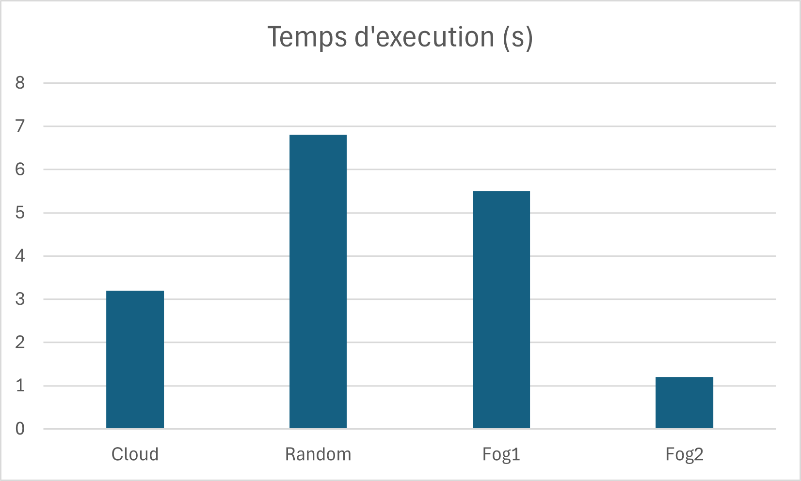

# Comtpe Rendu Projet iFogSim <!-- omit in toc -->
par *Aaron RANDRIANARISONA* et *Valentin RICARDO*

## Table des matières <!-- omit in toc -->
- [1. Sujet du projet](#1-sujet-du-projet)
- [2. Configuration](#2-configuration)
- [3. Algorithmes de placement](#3-algorithmes-de-placement)
  - [3.1. Cloud](#31-cloud)
  - [3.2. Random](#32-random)
  - [3.3. Fog1](#33-fog1)
  - [3.4. Fog2](#34-fog2)
- [4. Comparaison des algorithmes](#4-comparaison-des-algorithmes)
  - [4.1. Algorithme de Placement Cloud](#41-algorithme-de-placement-cloud)
  - [4.2. Algorithme de Placement Aléatoire](#42-algorithme-de-placement-aléatoire)
  - [4.3. Algorithme de Placement Fog1](#43-algorithme-de-placement-fog1)
  - [4.4. Algorithme de Placement Fog2](#44-algorithme-de-placement-fog2)
- [5. Conclusion :](#5-conclusion-)
- [6. Problèmes rencontrés](#6-problèmes-rencontrés)

## 1. Sujet du projet

Le sujet de projet porte sur l'écriture d'un scénario de "ville intelligente" (SmartCity) qui vise à améliorer les services et le bien-être des citoyens urbains en utilisant des outils intelligents pour gérer divers aspects (ex: le transport, la domotique, la santé, la distribution de l'énergie et de l'eau, etc...). L'objectif principal est de **déployer** ce scénario dans une **infrastructure de type Fog**, Cloud, comprenant des capteurs, des nœuds de Fog (Passerelles, LFOG, RFOG) et des centres de données. Les nœuds de Fog sont organisés de manière hiérarchique pour assurer la gestion efficace des services de la ville intelligente.

Chaque donnée produites dans le système est consommé par 1 unique service choisi aléatoirement.

## 2. Configuration
Dans notre cas d'utilisation, on a augmenté le temps de simulation pour le bien du projet. Si vous souhaitez le modifier, suivre la procédure :
- Aller dans `src/org/fog/utils/Config.java`
- Changer la variable `MAX_SIMULATION_TIME` à 1000\*60\*60 (car en millisecondes)
- Aller dans `src\org\cloudbus\cloudsim\Host.java`
- Mettre en commentaire le bloc sous la condition `getTotalMips() < vm.getMips()`

## 3. Algorithmes de placement
### 3.1. Cloud
Toutes les instances de services sont déployées dans les centres de données du Cloud

### 3.2. Random
Les instances de services sont déployées dans des nœuds de Fog (et centre de
données) choisis aléatoirement.

### 3.3. Fog1
Cet algorithme à une particularité de placement plutôt spéciale. Les instances de services et les nœuds de Fog doivent être triés en ordre ascendant selon les MI et MIPS disponibles.
Il doit y avoir 3 services par fogDevices (HGW -> LFogX -> RFogX -> DataCenterX), avec X un numéro aléatoire de fogDevice

### 3.4. Fog2
De même que pour l'algo de placement Fog1, les instances de services et les nœuds de Fog doivent être triés, mais cette fois en ordre descendant.
:warning: Attention à placer les DataCenter à la fin, sinon on retrouverait une configuration similaire à Cloud où tous les services sont déployés dans les DataCenter, ce qu'on ne veut pas. 

Cela nous donne un ordre comme ceci : (RFogX -> LFogX -> HGW -> DataCenterX)

## 4. Comparaison des algorithmes

Pour comparer les quatre algorithmes de placement, évaluons chacun en fonction de leurs caractéristiques :

### 4.1. Algorithme de Placement Cloud
- **Complexité Temporelle** : Linéaire, car il itère à travers chaque service et l'assigne à un datacenter aléatoire.
- **Avantages** :
  - Simple à mettre en œuvre.
  - Distribution uniforme des services à travers les datacenters.
- **Inconvénients** :
  - Peut entraîner une utilisation inégale des ressources dans les datacenters.
  - Ne prend pas en compte la latence réseau ou les capacités des appareils.

### 4.2. Algorithme de Placement Aléatoire
- **Complexité Temporelle** : Linéaire, car il itère à travers chaque service et sélectionne aléatoirement un dispositif fog.
- **Avantages** :
  - Relativement simple.
  - Distribue les services de manière aléatoire, ce qui pourrait équilibrer la charge dans certains scénarios.
- **Inconvénients** :
  - Peut entraîner une utilisation inégale des ressources.
  - Ignore la latence réseau et les capacités des appareils.
  - Pas du tout fiable car inconsistant.

### 4.3. Algorithme de Placement Fog1
- **Complexité Temporelle** : Linéaire, trie les dispositifs fog en fonction des MIPS disponibles, puis itère à travers les services en les assignant aux dispositifs fog avec des ressources disponibles.
- **Avantages** :
  - Tente de distribuer uniformément les services en fonction des ressources disponibles.
  - Tient compte des capacités des appareils (MIPS et RAM).
- **Inconvénients** :
  - Peut ne pas exploiter pleinement toutes les ressources, surtout si les appareils ont des capacités différentes.
  - Reste sensible à la distribution inégale de la charge.

### 4.4. Algorithme de Placement Fog2
- **Complexité Temporelle** : Linéaire, trie les dispositifs fog en fonction des MIPS disponibles, puis itère à travers les services en les assignant aux dispositifs fog avec des ressources disponibles.
- **Avantages** :
  - Tient compte à la fois des ressources disponibles et de la proximité réseau.
  - Priorise les plus grands dispositifs fog, ce qui peut entraîner une meilleure utilisation des ressources.
- **Inconvénients** :
  - La complexité peut augmenter si la topologie réseau est plus complexe.
  - Nécessite des mesures de latence précises.

<!-- TODO : Insérer un graphe comparatif -->

Figure 1 : Tableau comparatif

## 5. Conclusion :
- **Meilleure Approche** : L'algorithme "Fog2" semble être le plus complet car il prend en compte à la fois les capacités des appareils et la latence réseau. En priorisant les plus grands dispositifs fog et en tenant compte de la proximité réseau, il est susceptible d'obtenir une meilleure utilisation des ressources et de réduire la latence. Cependant, son efficacité peut dépendre de la topologie réseau spécifique et des caractéristiques de la charge de travail.
- **Simplicité vs Performance** : Bien que les algorithmes "Cloud" et "Aléatoire" soient plus simples à mettre en œuvre, ils sacrifient l'optimisation des performances. Selon les besoins de l'application et l'échelle de l'architecture fog, un équilibre entre simplicité et performance doit être trouvé.

## 6. Problèmes rencontrés
Lors du développement du projet, nous et les autres groupes avons rencontrés pas mal de problèmes :

- **Difficile d'exécuter le projet**. Sans une bonne machine, il est impossible d'espérer reprendre ce projet
- **Difficulté du projet**. Pas évident de plonger dans le code et d'imaginer toute la suite des évènements sans un bon cahier de charges. Certaines indications prêtaient aussi à confusion, comme la nomination des capteurs en "s" qui pourrait facilement être confondue avec "service", ou bien "dc" pour la donnée du capteur avec "data center". La complexité de l'application ne rendait pas le débogage évident, par exemple pour trouver l'origine de l'erreur "[VmScheduler.vmCreate] Allocation of VM #S19 to Host #HGW19 failed by mips", il a fallu parcourir en profondeur les répertoires du projet. Au final, on ne sait pas s'il est plus pertinent de mettre en commentaire la condition sur le mips ou bien de changer les valeurs données initialement et leurs conséquences.